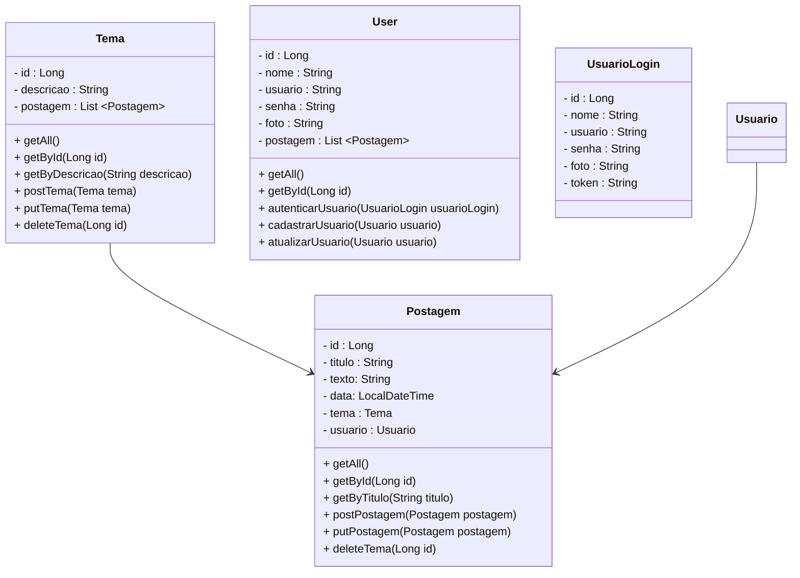

# Projeto Blog Pessoal

Projeto Blog Pessoal desenvolvido em ASP.NET - Core 7

 

     

  

## Diagrama de Classes

  

## Bibliotecas

- API
    - Entity Framework
    - SQL Server Client
    - Newton Soft JSON
    - Fluent Validation
    - Open API - Swagger
    - JWT - Bearer
    - Authentication JWT
    - Bcrypt
- Testes
    - xUnit (Testes de Integração)
    - inMemory Database (Mock do Banco de dados)
    - MVC Testing
- Deploy
    - NPGSQL - Postgres (Deploy no Render)
